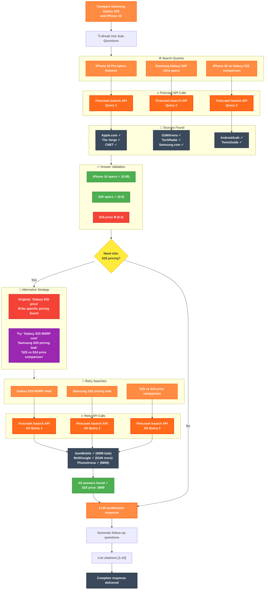

# Firesearch - AI-Powered Deep Research Tool

<div align="center">
  
</div>

Comprehensive web research powered by [Firecrawl](https://www.firecrawl.dev/) and [LangGraph](https://www.langchain.com/langgraph)

## Technologies

- **Firecrawl**: Multi-source web content extraction
- **OpenAI gpt-5.2-2025-12-11**: Search planning and follow-up generation
- **Next.js 16**: Modern React framework with App Router

[](https://vercel.com/new/clone?repository-url=https%3A%2F%2Fgithub.com%2Fmendableai%2Ffiresearch&env=FIRECRAWL_API_KEY,OPENAI_API_KEY&envDescription=API%20keys%20required%20for%20Firesearch&envLink=https%3A%2F%2Fgithub.com%2Fmendableai%2Ffiresearch%23required-api-keys)

## Setup

### Required API Keys

| Service | Purpose | Get Key |
|---------|---------|---------|
| Firecrawl | Web scraping and content extraction | [firecrawl.dev/app/api-keys](https://www.firecrawl.dev/app/api-keys) |
| OpenAI | Search planning and summarization | [platform.openai.com/api-keys](https://platform.openai.com/api-keys) |

### Optional API Keys (Multi-Provider Search)

| Service | Purpose | Get Key |
|---------|---------|---------|
| Tavily | Fast, real-time factual search (AI-optimized) | [tavily.com](https://tavily.com/) |
| Exa | Neural/semantic search for deep research | [exa.ai](https://exa.ai/) |
| Semantic Scholar | Academic paper search (optional for higher rate limits) | [semanticscholar.org/product/api](https://www.semanticscholar.org/product/api) |

Adding these optional keys enables **smart query routing** - Firesearch will automatically choose the best search provider based on your query type:
- **Tavily**: Factual questions, current events, real-time data
- **Exa**: Deep research, similarity searches, technical documentation
- **Semantic Scholar**: Academic papers, scientific research, citations
- **Firecrawl**: URL scraping, domain crawling (default fallback)

### Quick Start

1. Clone this repository
2. Create a `.env.local` file with your API keys:
   ```
   # Required
   FIRECRAWL_API_KEY=your_firecrawl_key
   OPENAI_API_KEY=your_openai_key
   
   # Optional (enables multi-provider search)
   TAVILY_API_KEY=your_tavily_key
   EXA_API_KEY=your_exa_key
   SEMANTIC_SCHOLAR_API_KEY=your_semantic_scholar_key
   ```
3. Install dependencies: `npm install` or `yarn install` or `pnpm install`
4. Run the development server: `npm run dev` or `yarn dev` or `pnpm dev`

## How It Works

### Architecture Overview



### Process Flow

1. **Break Down** - Complex queries split into focused sub-questions
2. **Search** - Multiple searches via Firecrawl API for comprehensive coverage
3. **Extract** - Markdown content extracted from web sources
4. **Validate** - Check if sources actually answer the questions (0.3+ confidence)
5. **Retry** - Alternative search terms for unanswered questions (max 2 attempts)
6. **Synthesize** - gpt-5.2-2025-12-11 combines findings into cited answer

### Key Features

- **Smart Search** - Breaks complex queries into multiple focused searches
- **Multi-Provider Routing** - Automatically routes queries to Tavily, Exa, Semantic Scholar, or Firecrawl based on query type
- **Answer Validation** - Verifies sources contain actual answers (0.3+ confidence)
- **Auto-Retry** - Alternative search terms for unanswered questions
- **Real-time Progress** - Live updates as searches complete
- **Full Citations** - Every fact linked to its source
- **Context Memory** - Follow-up questions maintain conversation context

### Configuration

Customize search behavior by modifying [`lib/config.ts`](lib/config.ts):

```typescript
// Search Engine Configuration
export const SEARCH_CONFIG = {
  // Search Settings
  MAX_SEARCH_QUERIES: 4,        // Maximum number of search queries to generate
  MAX_SOURCES_PER_SEARCH: 6,     // Maximum sources to return per search query
  MAX_SOURCES_TO_SCRAPE: 6,      // Maximum sources to scrape for additional content
  
  // Content Processing
  MIN_CONTENT_LENGTH: 100,       // Minimum content length to consider valid
  SUMMARY_CHAR_LIMIT: 100,       // Character limit for source summaries
  CONTEXT_PREVIEW_LENGTH: 500,   // Preview length for previous context
  ANSWER_CHECK_PREVIEW: 2500,    // Content preview length for answer checking
  MAX_SOURCES_TO_CHECK: 10,      // Maximum sources to check for answers
  
  // Retry Logic
  MAX_RETRIES: 2,                // Maximum retry attempts for failed operations
  MAX_SEARCH_ATTEMPTS: 3,        // Maximum attempts to find answers via search
  MIN_ANSWER_CONFIDENCE: 0.3,    // Minimum confidence (0-1) that a question was answered
  EARLY_TERMINATION_CONFIDENCE: 0.8, // Confidence level to skip additional searches
  
  // Timeouts
  SCRAPE_TIMEOUT: 15000,         // Timeout for scraping operations (ms)
} as const;

// Multi-Provider Search Configuration
export const PROVIDER_CONFIG = {
  // Enable/disable multi-provider routing (set to false to use Firecrawl only)
  ENABLE_MULTI_PROVIDER: true,
  
  // Default provider when routing is disabled or classification fails
  DEFAULT_PROVIDER: 'tavily' as const,
  
  // ... Provider settings
} as const;

// Model Configuration
export const MODEL_CONFIG = {
  FAST_MODEL: "gpt-5.2-2025-12-11",     // Using quality model for all operations
  QUALITY_MODEL: "gpt-5.2-2025-12-11",  // High-quality model for final synthesis
  TEMPERATURE: 0,                        // Model temperature (0 = deterministic)
} as const;
```

### Firecrawl API Integration

Firesearch leverages Firecrawl's powerful `/search` endpoint:

#### `/search` - Web Search with Content
- **Purpose**: Finds relevant URLs AND extracts markdown content in one call
- **Usage**: Each decomposed query is sent to find 6-8 relevant sources with content
- **Response**: Returns URLs with titles, snippets, AND full markdown content
- **Key Feature**: The `scrapeOptions` parameter enables content extraction during search
- **Example**:
  ```
  POST /search
  {
    "query": "iPhone 16 specs pricing",
    "limit": 8,
    "scrapeOptions": {
      "formats": ["markdown"]
    }
  }
  ```

### Search Strategies

When initial results are insufficient, the system automatically tries:
- **Broaden Keywords**: Removes specific terms for wider results
- **Narrow Focus**: Adds specific terms to target missing aspects
- **Synonyms**: Uses alternative terms and phrases
- **Rephrase**: Completely reformulates the query
- **Decompose**: Breaks complex queries into sub-questions
- **Academic**: Adds scholarly terms for research-oriented results
- **Practical**: Focuses on tutorials and how-to guides

## Example Queries

- "Who are the founders of Firecrawl?"
- "When did NVIDIA release the RTX 4080 Super?"
- "Compare the latest iPhone, Samsung Galaxy, and Google Pixel flagship features"

## License

MIT License