# Firesearch - AI-Powered Deep Research Tool

<div align="center">
  
</div>

Comprehensive web research powered by [Firecrawl](https://www.firecrawl.dev/) and [LangGraph](https://www.langchain.com/langgraph)

## Technologies

- **Firecrawl**: Multi-source web content extraction
- **OpenAI GPT-4o**: Search planning and follow-up generation
- **Next.js 15**: Modern React framework with App Router

[](https://vercel.com/new/clone?repository-url=https%3A%2F%2Fgithub.com%2Fmendableai%2Ffiresearch&env=FIRECRAWL_API_KEY,OPENAI_API_KEY&envDescription=API%20keys%20required%20for%20Firesearch&envLink=https%3A%2F%2Fgithub.com%2Fmendableai%2Ffiresearch%23required-api-keys)

## Setup

### Required API Keys

| Service | Purpose | Get Key |
|---------|---------|---------|
| Firecrawl | Web scraping and content extraction | [firecrawl.dev/app/api-keys](https://www.firecrawl.dev/app/api-keys) |
| OpenAI | Search planning and summarization | [platform.openai.com/api-keys](https://platform.openai.com/api-keys) |

### Quick Start

1. Clone this repository
2. Create a `.env.local` file with your API keys:
   ```
   FIRECRAWL_API_KEY=your_firecrawl_key
   OPENAI_API_KEY=your_openai_key
   ```
3. Install dependencies: `npm install` or `yarn install`
4. Run the development server: `npm run dev` or `yarn dev`

## How It Works

### Architecture Overview

```mermaid
flowchart TB
    %% User Query
    Query["🔍 User Query<br/><i>e.g., Compare iPhone 16, Samsung S25, and Google Pixel 9</i>"]:::query
    
    %% Break Query Phase
    Break["🧩 Break Query into Multiple Searches<br/><i>LangGraph Orchestration</i>"]:::primary
    
    %% Individual Searches
    Search1["📱 iPhone 16 specs pricing"]:::search
    Search2["📱 Samsung Galaxy S25 review"]:::search
    Search3["📱 Google Pixel 9 Pro features"]:::search
    
    %% Web Sources
    subgraph Sources1[" "]
        S1A["TechRadar<br/>iPhone 16 Review"]:::source
        S1B["Apple.com<br/>Official Specs"]:::source
        S1C["The Verge<br/>In-depth Analysis"]:::source
    end
    
    subgraph Sources2[" "]
        S2A["GSMArena<br/>S25 Ultra Specs"]:::source
        S2B["Samsung.com<br/>Features Page"]:::source
        S2C["Tom's Guide<br/>S25 Review"]:::source
    end
    
    subgraph Sources3[" "]
        S3A["DXOMark<br/>Camera Tests"]:::source
        S3B["Google Store<br/>Pixel 9 Pro"]:::source
        S3C["Android Authority<br/>Camera Review"]:::source
    end
    
    %% Extract Markdown Phase
    Extract1["📄 Extract Markdown<br/><i>Firecrawl API</i>"]:::extract
    Extract2["📄 Extract Markdown<br/><i>Firecrawl API</i>"]:::extract
    Extract3["📄 Extract Markdown<br/><i>Firecrawl API</i>"]:::extract
    
    %% Summarize Phase
    Sum1["📝 Summarize"]:::summarize
    Sum2["📝 Summarize"]:::summarize
    Sum3["📝 Summarize"]:::summarize
    
    %% Synthesis Engine
    Synthesis["🧠 Synthesis Engine<br/><i>GPT-4o with Context Processing</i>"]:::synthesis
    
    %% Final Answer
    Answer["📊 Comprehensive Phone Comparison<br/>with citations from all 9 sources"]:::answer
    
    %% Connections
    Query --> Break
    Break --> Search1
    Break --> Search2
    Break --> Search3
    
    Search1 --> Sources1
    Search2 --> Sources2
    Search3 --> Sources3
    
    Sources1 --> Extract1
    Sources2 --> Extract2
    Sources3 --> Extract3
    
    Extract1 --> Sum1
    Extract2 --> Sum2
    Extract3 --> Sum3
    
    Sum1 --> Synthesis
    Sum2 --> Synthesis
    Sum3 --> Synthesis
    
    Synthesis --> Answer
    
    %% Summary Box
    Summary["Total: 3 searches → 9 web pages scraped → 9 markdowns → 9 summaries"]:::summary
    
    %% Styling
    classDef query fill:#ff8c42,stroke:#ff6b1a,stroke-width:3px,color:#fff
    classDef primary fill:#3a4a5c,stroke:#2c3a47,stroke-width:3px,color:#fff
    classDef search fill:#ff8c42,stroke:#ff6b1a,stroke-width:2px,color:#fff
    classDef source fill:#3a4a5c,stroke:#2c3a47,stroke-width:2px,color:#fff
    classDef extract fill:#ff8c42,stroke:#ff6b1a,stroke-width:2px,color:#fff
    classDef summarize fill:#3a4a5c,stroke:#2c3a47,stroke-width:2px,color:#fff
    classDef synthesis fill:#ff8c42,stroke:#ff6b1a,stroke-width:3px,color:#fff
    classDef answer fill:#3a4a5c,stroke:#2c3a47,stroke-width:3px,color:#fff
    classDef summary fill:#f0f0f0,stroke:#ccc,stroke-width:1px,color:#333
```



### Detailed Process Flow

1. **Understanding**: Analyzes your query to identify key research needs
2. **Planning**: Generates multiple search queries for comprehensive coverage
3. **Searching**: Finds relevant sources across the web using Firecrawl's search API
4. **Scraping**: Extracts full content from the most relevant sources
5. **Analyzing**: Processes and scores content based on relevance to your query
6. **Synthesizing**: Combines findings into a well-cited, comprehensive answer using GPT-4o

### Key Features

- **Multi-Query Decomposition**: Complex queries are intelligently broken down into multiple focused searches
- **Real-time Progress Updates**: See exactly what the system is searching for and finding
- **Smart Content Extraction**: Uses Firecrawl to bypass paywalls and extract clean markdown content
- **Relevance Scoring**: Content is scored and summarized based on query relevance
- **Streaming Responses**: Answers are streamed in real-time as they're generated
- **Citation Tracking**: Every piece of information is properly cited with source links
- **Conversation Memory**: Follow-up questions maintain context from previous queries

## Example Queries

- "Who are the founders of Firecrawl?"
- "When did NVIDIA release the RTX 4080 Super?"
- "Compare the latest iPhone, Samsung Galaxy, and Google Pixel flagship features"

## License

MIT License