# Firesearch - AI-Powered Deep Research Tool

<div align="center">
  
</div>

Comprehensive web research powered by [Firecrawl](https://www.firecrawl.dev/) and [LangGraph](https://www.langchain.com/langgraph)

## Technologies

- **Firecrawl**: Multi-source web content extraction
- **OpenAI GPT-4o**: Search planning and follow-up generation
- **Next.js 15**: Modern React framework with App Router

[](https://vercel.com/new/clone?repository-url=https%3A%2F%2Fgithub.com%2Fmendableai%2Ffiresearch&env=FIRECRAWL_API_KEY,OPENAI_API_KEY&envDescription=API%20keys%20required%20for%20Firesearch&envLink=https%3A%2F%2Fgithub.com%2Fmendableai%2Ffiresearch%23required-api-keys)

## Setup

### Required API Keys

| Service | Purpose | Get Key |
|---------|---------|---------|
| Firecrawl | Web scraping and content extraction | [firecrawl.dev/app/api-keys](https://www.firecrawl.dev/app/api-keys) |
| OpenAI | Search planning and summarization | [platform.openai.com/api-keys](https://platform.openai.com/api-keys) |

### Quick Start

1. Clone this repository
2. Create a `.env.local` file with your API keys:
   ```
   FIRECRAWL_API_KEY=your_firecrawl_key
   OPENAI_API_KEY=your_openai_key
   ```
3. Install dependencies: `npm install` or `yarn install`
4. Run the development server: `npm run dev` or `yarn dev`

## How It Works

### Architecture Overview

```mermaid
flowchart TB
    Query["'Compare Samsung Galaxy S25<br/>and iPhone 16'"]:::query
    
    Query --> Break
    
    Break["🔍 Break into Sub-Questions"]:::primary
    
    subgraph SubQ["🌐 Search Queries"]
        S1["iPhone 16 Pro specs features"]:::search
        S2["Samsung Galaxy S25 Ultra specs"]:::search
        S3["iPhone 16 vs Galaxy S25 comparison"]:::search
    end
    
    Break --> SubQ
    
    subgraph FC["🔥 Firecrawl API Calls"]
        FC1["Firecrawl /search API<br/>Query 1"]:::firecrawl
        FC2["Firecrawl /search API<br/>Query 2"]:::firecrawl
        FC3["Firecrawl /search API<br/>Query 3"]:::firecrawl
    end
    
    S1 --> FC1
    S2 --> FC2
    S3 --> FC3
    
    subgraph Sources["📄 Sources Found"]
        R1["Apple.com ✓<br/>The Verge ✓<br/>CNET ✓"]:::source
        R2["GSMArena ✓<br/>TechRadar ✓<br/>Samsung.com ✓"]:::source
        R3["AndroidAuth ✓<br/>TomsGuide ✓"]:::source
    end
    
    FC1 --> R1
    FC2 --> R2
    FC3 --> R3
    
    subgraph Valid["✅ Answer Validation"]
        V1["iPhone 16 specs ✓ (0.95)"]:::good
        V2["S25 specs ✓ (0.9)"]:::good
        V3["S25 price ❌ (0.3)"]:::bad
    end
    
    Sources --> Valid
    
    Valid --> Retry
    
    Retry{"Need info:<br/>S25 pricing?"}:::check
    
    subgraph Strat["🧠 Alternative Strategy"]
        Original["Original: 'Galaxy S25 price'<br/>❌ No specific pricing found"]:::bad
        NewTerms["Try: 'Galaxy S25 MSRP cost'<br/>'Samsung S25 pricing leak'<br/>'S25 vs S24 price comparison'"]:::strategy
    end
    
    Retry -->|Yes| Strat
    
    subgraph Retry2["🔄 Retry Searches"]
        Alt1["Galaxy S25 MSRP retail"]:::search
        Alt2["Samsung S25 pricing leak"]:::search
        Alt3["S25 vs S24 price comparison"]:::search
    end
    
    Strat --> Retry2
    
    subgraph FC2G["🔥 Retry API Calls"]
        FC4["Firecrawl /search API<br/>Alt Query 1"]:::firecrawl
        FC5["Firecrawl /search API<br/>Alt Query 2"]:::firecrawl
        FC6["Firecrawl /search API<br/>Alt Query 3"]:::firecrawl
    end
    
    Alt1 --> FC4
    Alt2 --> FC5
    Alt3 --> FC6
    
    Results2["SamMobile ✓ ($899 leak)<br/>9to5Google ✓ ($100 more)<br/>PhoneArena ✓ ($899)"]:::source
    
    FC4 --> Results2
    FC5 --> Results2
    FC6 --> Results2
    
    Final["All answers found ✓<br/>S25 price: $899"]:::good
    
    Results2 --> Final
    
    Synthesis["LLM synthesizes response"]:::synthesis
    
    Final --> Synthesis
    
    FollowUp["Generate follow-up questions"]:::primary
    
    Synthesis --> FollowUp
    
    Citations["List citations [1-10]"]:::primary
    
    FollowUp --> Citations
    
    Answer["Complete response delivered"]:::answer
    
    Citations --> Answer
    
    %% No path - skip retry and go straight to synthesis
    Retry -->|No| Synthesis
    
    classDef query fill:#ff8c42,stroke:#ff6b1a,stroke-width:3px,color:#fff
    classDef subq fill:#ffd4b3,stroke:#ff6b1a,stroke-width:1px,color:#333
    classDef search fill:#ff8c42,stroke:#ff6b1a,stroke-width:2px,color:#fff
    classDef source fill:#3a4a5c,stroke:#2c3a47,stroke-width:2px,color:#fff
    classDef check fill:#ffeb3b,stroke:#fbc02d,stroke-width:2px,color:#333
    classDef good fill:#4caf50,stroke:#388e3c,stroke-width:2px,color:#fff
    classDef bad fill:#f44336,stroke:#d32f2f,stroke-width:2px,color:#fff
    classDef strategy fill:#9c27b0,stroke:#7b1fa2,stroke-width:2px,color:#fff
    classDef synthesis fill:#ff8c42,stroke:#ff6b1a,stroke-width:3px,color:#fff
    classDef answer fill:#3a4a5c,stroke:#2c3a47,stroke-width:3px,color:#fff
    classDef firecrawl fill:#ff6b1a,stroke:#ff4500,stroke-width:3px,color:#fff
    classDef label fill:none,stroke:none,color:#666,font-weight:bold
```



### Process Flow

1. **Break Down** - Complex queries split into focused sub-questions
2. **Search** - Multiple searches via Firecrawl API for comprehensive coverage
3. **Extract** - Markdown content extracted from web sources
4. **Validate** - Check if sources actually answer the questions (0.7+ confidence)
5. **Retry** - Alternative search terms for unanswered questions (max 2 attempts)
6. **Synthesize** - GPT-4o combines findings into cited answer

### Key Features

- **Smart Search** - Breaks complex queries into multiple focused searches
- **Answer Validation** - Verifies sources contain actual answers (0.7+ confidence)
- **Auto-Retry** - Alternative search terms for unanswered questions
- **Real-time Progress** - Live updates as searches complete
- **Full Citations** - Every fact linked to its source
- **Context Memory** - Follow-up questions maintain conversation context

### Configuration

Customize search behavior by modifying [`lib/config.ts`](lib/config.ts):

```typescript
export const SEARCH_CONFIG = {
  // Search Settings
  MAX_SEARCH_QUERIES: 12,        // Maximum number of search queries to generate
  MAX_SOURCES_PER_SEARCH: 4,     // Maximum sources to return per search query
  MAX_SOURCES_TO_SCRAPE: 3,      // Maximum sources to scrape for additional content
  
  // Content Processing
  MIN_CONTENT_LENGTH: 100,       // Minimum content length to consider valid
  SUMMARY_CHAR_LIMIT: 100,       // Character limit for source summaries
  
  // Retry Logic
  MAX_RETRIES: 2,                // Maximum retry attempts for failed operations
  MAX_SEARCH_ATTEMPTS: 2,        // Maximum attempts to find answers via search
  MIN_ANSWER_CONFIDENCE: 0.7,    // Minimum confidence (0-1) that a question was answered
  
  // Timeouts
  SCRAPE_TIMEOUT: 15000,         // Timeout for scraping operations (ms)
} as const;
```

### Firecrawl API Integration

Firesearch leverages Firecrawl's powerful `/search` endpoint:

#### `/search` - Web Search with Content
- **Purpose**: Finds relevant URLs AND extracts markdown content in one call
- **Usage**: Each decomposed query is sent to find 6-8 relevant sources with content
- **Response**: Returns URLs with titles, snippets, AND full markdown content
- **Key Feature**: The `scrapeOptions` parameter enables content extraction during search
- **Example**:
  ```
  POST /search
  {
    "query": "iPhone 16 specs pricing",
    "limit": 8,
    "scrapeOptions": {
      "formats": ["markdown"]
    }
  }
  ```

### Search Strategies

When initial results are insufficient, the system automatically tries:
- **Broaden Keywords**: Removes specific terms for wider results
- **Narrow Focus**: Adds specific terms to target missing aspects
- **Synonyms**: Uses alternative terms and phrases
- **Rephrase**: Completely reformulates the query
- **Decompose**: Breaks complex queries into sub-questions
- **Academic**: Adds scholarly terms for research-oriented results
- **Practical**: Focuses on tutorials and how-to guides

## Example Queries

- "Who are the founders of Firecrawl?"
- "When did NVIDIA release the RTX 4080 Super?"
- "Compare the latest iPhone, Samsung Galaxy, and Google Pixel flagship features"

## License

MIT License